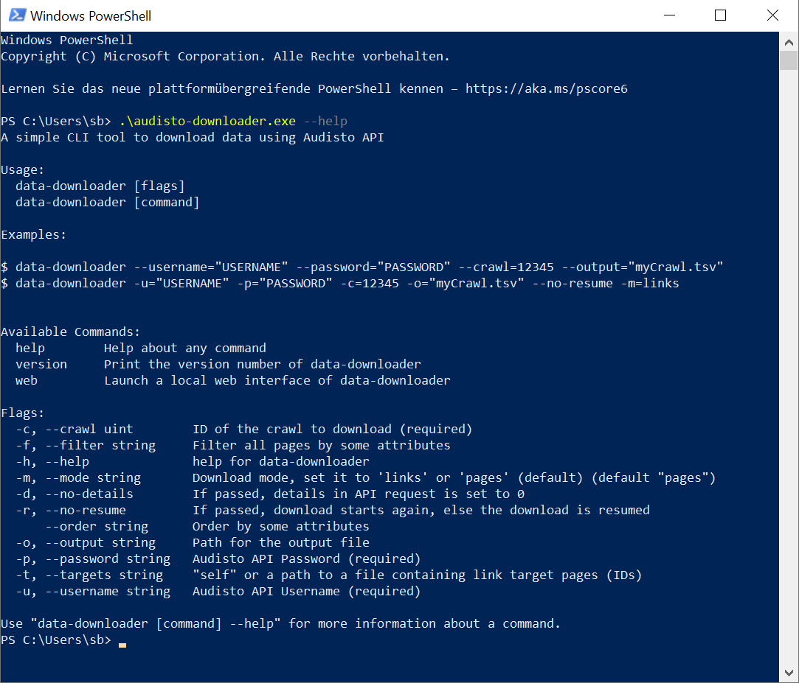
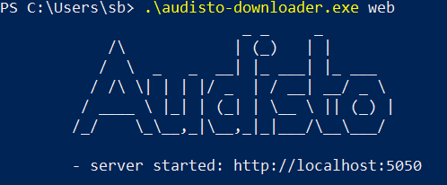
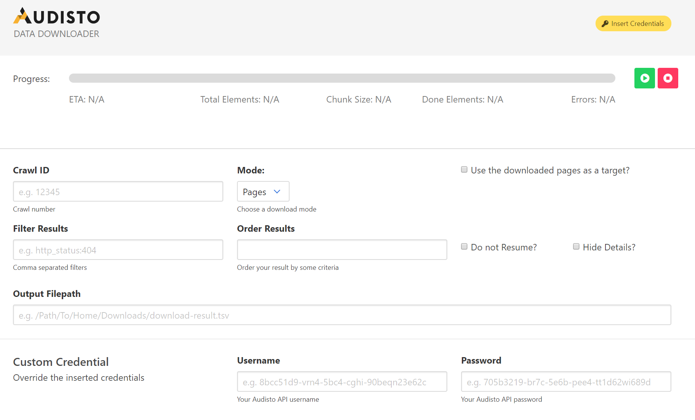

# Audisto Data-Downloader

[](https://travis-ci.org/audisto/data-downloader)
 [](https://godoc.org/github.com/audisto/data-downloader)
 [](https://goreportcard.com/report/github.com/audisto/data-downloader)

A command line tool for easy data downloads, even for very large Gigabyte files, using the [Audisto](https://audisto.com/) API. The data-downloader will automatically combine all chunks into one file.

## Usage

Instructions:

```text
Usage: data-downloader [OPTIONS]

Parameters:
  -u, --username=[USERNAME]     Audisto API Username (required)
  -p, --password=[PASSWORD]     Audisto API Password (required)
  -c, --crawl=[ID]              ID (uint) of the crawl to download (required)
  -f, --filter=[FILTER]         Filter all pages by given FILTER
  -h, --help                    help for data-downloader
  -m, --mode=[pages/links]      Download mode, set it to 'links' or 'pages' (default)
  -d, --no-details              If passed, details in API request is set to 0
  -r, --no-resume               If passed, download starts again, else the download is resumed
      --order=[ORDER]           all pages are ordered by given ORDER
  -o, --output=[FILE]           Path for the output file
  -t, --targets=[self/FILE]     "self" or a path to a FILE containing link target pages (IDs)
```

Examples to start a new download or resume a download with all details, using long or short versions:

```shell
data-downloader --username="USERNAME" --password="PASSWORD" --crawl=12345 --output="myCrawl.tsv"
data-downloader -u="USERNAME" -p="PASSWORD" -c=12345 -o="myCrawl.tsv"
```

### Debug / Verbose mode

You can make the tool verbose about what is exactly performing, and what requests are being sent to Audisto API by setting `DD_DEBUG` (short for data-downloader debug) environment variable to `1` or `true` in your current terminal session.

```text
DD_DEBUG=true data-downloader [flags]
```

## Installation

You may download the latest compiled executables from the [releases section](https://github.com/audisto/data-downloader/releases). Even beta versions are very stable - you should always download the latest version. Download the version for your OS (PC, Mac or Linux) and maybe rename it for example into `data-downloader`.

Hint for Macintosh Users if you can't use the executable because its a .dms:

> A file with a .dms extension is a file that has been downloaded and renamed by the Apple Safari web browser or the Apple Mail email client. It contains the contents of a file that did not have a file extension or was erroneously renamed when downloaded. The .dms extension is a result of a bug in Safari and Mail - you can just rename it.

## Usage by Command-Line

One way to use the data-downloader is by command-line:

For Windows users, you either start a CMD command prompt or right-click your Windows start button, left-hand on your taskbar, and start a "Windows PowerShell". Navigate to the folder with your executable. *Hint: PS will start in your user folder, so an easy way is to just drop the .exe in that folder.*

If you use the PowerShell, instead of a command prompt, you need to prefix the executable with "point and backslash" like this, because its not a Cmdlet:

```powershell
.\data-downloader.exe [OPTIONS]
```



## Usage by Web Interface

A more comfortable way to use the data-downloader is by starting the local web server that provides you with a web interface you can use via any browser. You start the data downloader server by using the "web" option. For PC PowerShell like this:

```powershell
.\data-downloader.exe web
```

When the server is running you'll see the "server started" message



and now you can access the web interface by copying <http://localhost:5050> into your browser. If you use it often, create a browser bookmark. You will shut down the web service by closing the PowerShell window.

The web interface will offer you all options in an easy to use interface like this:



### Tip: Create a Shortcut to run the Web Server

If you want to use the web interface regularly its a good idea to create a shortcut to run the web server.

For Windows: right-click and create a new shortcut, choose the data-downloader.exe as your target. Now edit the target (right-click the shortcut & select properties):

Change the target line to

```text
cmd /c "C:\PATH\audisto-downloader.exe web"
```

This should be translated by the system later in something like

```text
C:\Windows\System32\cmd.exe /C "C:\PATH\audisto-downloader.exe web"
```

PATH needs to be your own, if you stay in your user folder similar to C:\Users\NAME\

Save the shortcut and you are done. Now you can start the web server with an easy double-click.

## Usage Examples with Parameters

### Example: Download all 404, but add incoming links

Download the 404 by copying the command line from within the Audisto export dialogue including the `--filter=http_status:404` and manually add the targets=self parameter or check the "Use the downloaded pages as a target" in the web interface.

```shell
data-downloader [OPTIONS] --targets=self
```

### Example: Download all 30x Redirects, but add target links

Download the 301, 302, etc. by using a command line with the proper user & file options similar to the Audisto export dialogue and manually add the links-mode parameter (or switch the mode in the web interface) and add the `--filter=type:30x`

```shell
data-downloader [OPTIONS] --mode=links --filter=type:30x
```

*Note: The type 30x is valid to use and also do not confuse e.g. filter=type:301 (link) with filter=http_status:301 (page).*

## Installation from Source

Install Go:

Install the Go runtime by downloading the latest release from here: <https://golang.org/dl/>

Clone the repository:

```shell
git clone github.com/audisto/data-downloader
```

Compile:

```shell
make build
```
